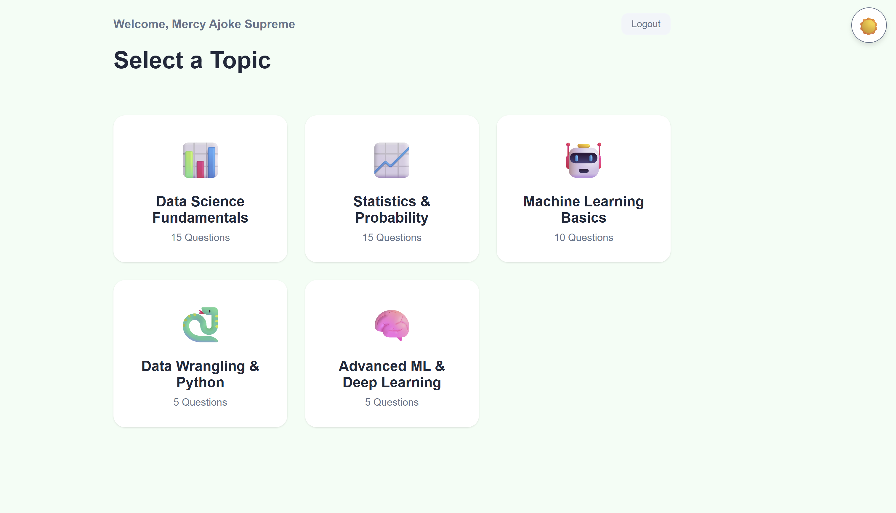

# 📊 Data Science Quiz Application

A modern, interactive quiz application built with vanilla JavaScript to test your Data Science knowledge. Features a sleek UI with theme toggling, category selection, timed questions, visual analytics, and a competitive leaderboard.

## Table of Contents

- [Overview](#overview)
  - [Screenshot](#screenshot)
  - [Features](#features)
- [Getting Started](#getting-started)
- [Project Structure](#project-structure)
- [Quiz Categories](#quiz-categories)
- [Technical Implementation](#technical-implementation)
  - [Built With](#built-with)
  - [Key Features](#key-features)
  - [Architecture](#architecture)
- [How It Works](#how-it-works)
- [Author](#author)

## Overview

Test your Data Science expertise with this comprehensive quiz application featuring 50 questions across 6 categories. Track your progress in real-time, compete on the leaderboard, and review your performance with detailed analytics.

### Screenshot



*Modern quiz interface with dark/light theme support*

### Features

✨ **User Experience**
- 🔐 User authentication with sign up/login system
- 🌓 Dark/Light theme toggle with persistent settings
- 📱 Fully responsive design for all devices
- ⏱️ Visual countdown timer for each question
- 📊 Real-time progress tracking

🎯 **Quiz Functionality**
- 📚 6 Data Science topic categories
- ❓ 50 handcrafted questions with varying difficulty
- ⏰ Timed questions (20-45 seconds per question)
- 🎯 Point-based scoring system (100-200 points per question)
- ⬅️➡️ Navigate between questions freely
- 💾 LocalStorage-based data persistence

📈 **Analytics & Results**
- 📊 Pie chart showing correct vs incorrect answers
- 📉 Bar chart displaying time spent per question
- ✅ Complete answer review with correct/incorrect indicators
- 🏆 Leaderboard ranking all users by high score
- 🎖️ Personal high score tracking

## Getting Started

1. **Clone or download this repository**

2. **Open the application**
   ```bash
   # Simply open index.html in your browser
   open index.html
   # or double-click the file
   ```

3. **Create an account**
   - Click "Sign Up" and enter your name, email, and password
   - Your data is stored locally in your browser

4. **Select a category**
   - Choose from 6 Data Science topics
   - View the number of questions in each category

5. **Take the quiz!**
   - Answer questions before the timer runs out
   - Navigate freely between questions
   - Submit when ready to see your results

## Project Structure

```
QA/
├── index.html                  # Main HTML structure
├── css/
│   └── style.css              # Styling and themes
├── javascript/
│   ├── app.js                 # Core quiz logic and state management
│   ├── auth.js                # Authentication and session handling
│   ├── questions.js           # Quiz questions database (50 questions)
│   ├── timer.js               # Countdown timer functionality
│   ├── charts.js              # Chart.js integration for visualizations
│   └── theme.js               # Dark/Light theme toggle
└── README.md
```

## Quiz Categories

The quiz covers **6 essential Data Science topics**:

1. **Data Science Fundamentals** (15 questions)
   - Core concepts, Python libraries (Pandas, NumPy, Matplotlib)
   - EDA, data cleaning, supervised vs unsupervised learning

2. **Statistics & Probability** (15 questions)
   - Mean, median, mode, standard deviation
   - Hypothesis testing, p-values, correlation, distributions

3. **Machine Learning Basics** (10 questions)
   - Train/test splits, classification algorithms
   - Cross-validation, confusion matrix, bias-variance tradeoff

4. **Data Wrangling & Python** (5 questions)
   - Pandas operations (dropna, groupby, concat)
   - Feature scaling, one-hot encoding

5. **Advanced ML & Deep Learning** (5 questions)
   - Neural networks, gradient descent, activation functions
   - Bagging vs boosting, PCA

Each category has questions worth **100-200 points** with time limits ranging from **20-45 seconds**.

## Technical Implementation

### Built With

- **HTML5** - Semantic structure with accessible form elements
- **CSS3** - Custom properties for theming, flexbox/grid layouts
- **Vanilla JavaScript (ES6+)** - No frameworks, pure DOM manipulation
- **Chart.js** - Interactive data visualizations
- **LocalStorage API** - Client-side data persistence

### Key Features

#### 🎨 Theme System (`theme.js`)
- Persistent theme selection stored in localStorage
- Dynamic CSS variable switching for dark/light modes
- Smooth transitions between themes

#### 🔐 Authentication (`auth.js`)
- User registration with validation (min 6-character password)
- Login with "Remember Me" functionality
- Session management via localStorage
- Password recovery placeholder

#### ⏱️ Timer System (`timer.js`)
- Visual circular countdown indicator
- Auto-submit when time expires
- Pause/resume on navigation
- Question-specific time limits

#### 📊 Analytics (`charts.js`)
- **Pie Chart**: Correct vs Incorrect answer distribution
- **Bar Chart**: Time spent on each question
- Built with Chart.js 3.x

#### 🧠 State Management (`app.js`)
```javascript
const state = {
    currentUser: null,
    currentQuestionIndex: 0,
    answers: [],           // User's selected answers
    timeSpent: [],         // Seconds spent on each question
    currentCategory: '',   // Selected category
    activeQuestions: []    // Filtered questions by category
};
```

### Architecture

1. **Screen Management**: 4 main screens (Auth → Category Selection → Quiz → Results)
2. **Event-Driven**: DOM event listeners for user interactions
3. **Modular Design**: Separate files for distinct responsibilities
4. **Data-First**: Questions stored as structured JSON objects

## How It Works

### Question Data Structure

```javascript
{
    id: 1,
    question: "What does 'Data Science' primarily involve?",
    options: ["Option A", "Option B", "Option C", "Option D"],
    correctIndex: 0,
    timeLimit: 20,        // seconds
    points: 100,
    category: "Data Science Fundamentals"
}
```

### User Flow

1. **Authentication** → Sign up or log in
2. **Category Selection** → Choose a topic area
3. **Quiz** → Answer timed questions with navigation
4. **Results** → View score, charts, answer review, and leaderboard

### Scoring System

- Each question is worth **100-200 points** based on difficulty
- Final score displayed as a **percentage** (totalPoints / maxPoints × 100)
- High scores are saved per user
- Leaderboard shows top 10 performers

### LocalStorage Schema

```javascript
// Users database
{
    "quizAppUsers": [
        {
            id: "unique-id",
            name: "John Doe",
            email: "john@example.com",
            password: "hashed-password",
            highScore: 85
        }
    ]
}

// Current session
{
    "quizAppSession": {
        id: "user-id",
        name: "John Doe",
        email: "john@example.com",
        highScore: 85
    }
}
```

## Author

**Mercy Ajoke Supreme**

- GitHub: [@MercySupremeAJ](https://github.com/MercySupremeAJ)

---

*Built to demonstrate modern vanilla JavaScript practices and Data Science knowledge* 🚀
